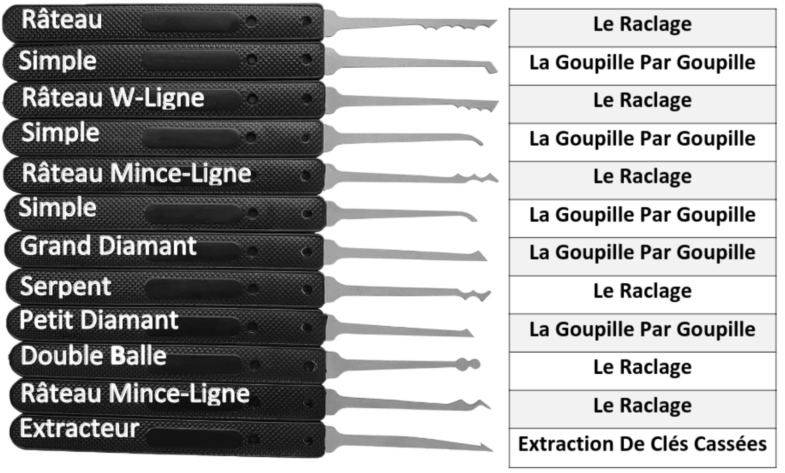
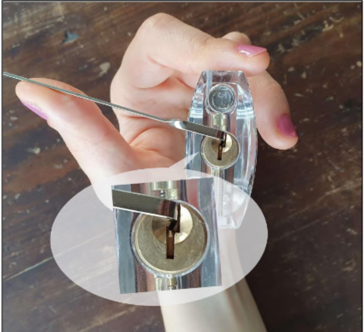
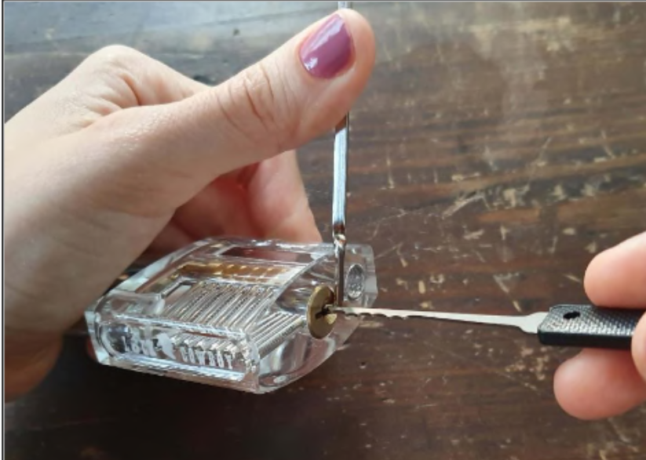
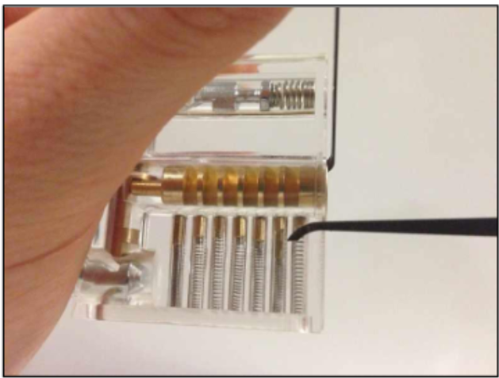

## Pourquoi apprendre à crocheter ?

### Introduction
La sécurité informatique est essentielle, mais il ne faut pas oublier la sécurité physique. En effet, il est possible de crocheter une serrure en quelques secondes, et il est donc important de savoir comment se protéger de ce genre d'attaque. Et se rendre compte de la robustesse de sa serrure est un bon moyen de se rendre compte de la sécurité d'un lieu sensible comme une salle de serveur.

### Composition d'une serrure

Une serrure est composée de plusieurs éléments, qui sont les suivants :

- Le barillet : c'est le cylindre qui contient les goupilles

- Les goupilles : ce sont des tiges qui bloquent le barillet tant qu'elles ne sont pas alignées

- Le ressort : c'est ce qui pousse les goupilles vers le bas

- Le stator : c'est la partie fixe de la serrure qui contient les goupilles

- Le rotor : c'est la partie qui tourne, qui contient le barillet

- Le pêne : c'est la partie qui va bloquer la porte

### Fonctionnement d'une serrure

Voici un GIF qui montre le fonctionnement d'une serrure :

### Les outils du crocheteur

Il existe plusieurs outils pour crocheter une serrure, mais les deux principaux sont les suivants :

- Le crochet : c'est un outil qui permet de pousser les goupilles vers le haut
- Le tensionneur : c'est un outil qui permet de faire tourner le rotor

Il existe différents types de crochets, avec différentes techniques d'utilisation, n'étant pas un expert en crochetage, je vais partager ceux que j'utilise le plus souvent et je vais expliquer comment les utiliser. En faisant référence a un manuel de crochetage que j'ai reçu avec un kit de crochetage.

une clé de tension :

### Le Raclage
Le but est d'appuyer les goupille avec votre crochet et alignez-les comme indiqué sur l'image. Cela imite ce que fait la clé lorsqu'elle est insérée dans la serrure

outils nécessaires :

- Un crochet râteau
- Clé de tension

#### Première étape 

Tenez le cadenas dans votre main
et insérez la clé de tension
comme indiqué. Tenant la serrure
dans cette position vous permet
d'appliquer et de réduire la
pression sur la clé de tension avec
votre doigt.
Ayez à l'esprit qu'il n'y a pas qu'un
seul "bon" moyen de tenir la
serrure. Choisissez simplement ce
qui vous semble le plus naturel.

#### Deuxième étape

Insérez le crochet râteau juste en
dessous de la clé de tension.
Lentement, « ratissez » sur les
goupilles et appuyez légèrement
dessus. En même temps,
appliquez doucement une
pression avec votre doigt sur la
clé de tension. Vous allez
commencer à sentir les goupilles
se placer (vous les entendrez
« cliquer ») !

#### Troisième étape
Tout en maintenant la pression
sur la clé de tension, inspectez où
sont les goupilles une fois que
vous avez senti que certains
d'elles ont cliqué.
Dans cette image, une goupille est
placée trop profond. Vous aurez
besoin de laisser la pression sur la
clé de tension pour réinitialiser les
goupilles et recommencer.

Au bout d'un moment, on sent que toutes les goupilles sont alignées, et on peut faire tourner le rotor pour ouvrir la serrure.

### Le Goupille À Goupille

Le but est d’appuyer sur les goupilles une par une individuellement avec votre crochet, et les aligner comme dans la méthode de raclage

##### outils nécessaires :

- Un crochet simple
- Clé de tension

#### Première étape 

La première étape est la même que pour la méthode de raclage, il faut tenir la serrure dans la main et insérer la clé de tension comme indiqué sur l'image de la méthode de raclage.

#### Deuxième étape

Voici un visuel de la marche a suivre :

Simplement, ce qu'il faut faire, c'est appuyer sur les goupilles une par une délicatement avec le crochet tout en appliquant une tension sur le barillet.
Il faut faire attention à ne pas appuyer trop fort sur les goupilles, sinon elles vont se bloquer et empêchera de faire tourner le barillet, il faudra tout recommencer en relâchant la tension sur le barillet.
Une fois l'on entend un petit **"clic"** c'est que la goupille est alignée, et on peut passer à la suivante.
Une fois que toutes les goupilles sont alignées, on peut faire tourner le barillet pour ouvrir la serrure.

#### Conclusion

Evidemment cette technique est plus difficile en fonction du nombre de goupilles, mais avec de l'entrainement, on peut crocheter une serrure en quelques secondes.
On peut imaginer très facilement que si on arrive à crocheter une serrure, on peut facilement accéder à un lieu sensible, et donc il est important de savoir comment se protéger de ce genre d'attaque. Il existe plusieurs techniques pour se protéger du crochetage, mais la plus simple est d'utiliser une serrure avec un système de sécurité supplémentaire, comme un système de sécurité électronique, ou une serrure avec un système de sécurité supplémentaire, comme un système anti-crochetage. Le tout est de savoir dimensionner la sécurité en fonction de la sensibilité du lieu et de l'asset à protéger.
