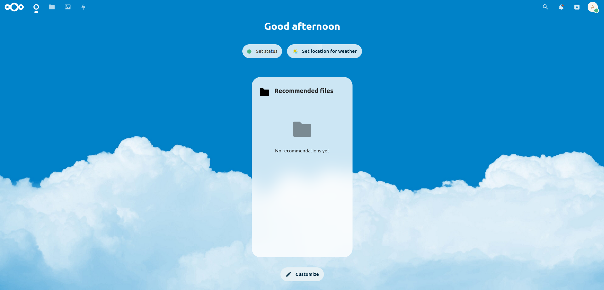

Nextcloud est une alternative open source aux services cloud tels que DropBox, Google Drive ou OneDrive. C'est donc une plateforme de partage et de stockage de fichiers en ligne. Il offre donc des fonctionnalités similaires à celles des services de cloud traditionnels, mais se distingue par sa nature open source et par la possibilité de le déployer à la maison. Voici quelques raisons pour installer NextCloud :

- On ne veut pas que nos données plus ou moins privées trainent sur internet et soit envoyer à l'autre bout de la planète.
- On veut progressivement se séparer des services que proposent les GAMAM.
- Pas de limite de stockage hormis le disque physique.
- On a un vieil ordinateur sous la main qui peut avoir une seconde vie

Comme prérequis, vous aurez notamment besoin d'aller voir les pages dédiées à la [gestion des containers Docker](../40-selfhost/07-docker.md).

Nous allons utiliser l'image Docker [linuxserver/nextcloud](https://hub.docker.com/r/linuxserver/nextcloud) qui contient la dernière version du serveur Nextcloud.

Voici le fichier `docker-compose` disponible sur la page de l'image.

```yaml
---
version: "2.1"
services:
  nextcloud:
    image: lscr.io/linuxserver/nextcloud:latest
    container_name: nextcloud
    environment:
      - PUID=1000
      - PGID=1000
      - TZ=Etc/UTC
    volumes:
      - /path/to/appdata:/config
      - /path/to/data:/data
    ports:
      - 3000:443
    restart: unless-stopped
```

:::danger

- N'oubliez pas de faire 2 volumes, un pour le stockage des données /data et un autre pour les fichiers de configuration /config
- On relie ici le port 3000 au port 443 du containeur, si vous avez un [reverse proxy](../40-selfhost/05-caddy.md) il suffira de rediriger votre sous domaine vers `http://localhost:3000/`
  :::

Lancer `docker-compose up` et si tout se passe bien, vous pouvez aller sur [https://localhost:3000/](https://localhost:3000/) pour créer le compte administrateur :


Après la création du compte admin vous pouvez vous connecter dessus !



Voila ! Votre serveur nextcloud est prêt à l'emploi, vous pouvez envoyer vos photos/documents dessus 😁
