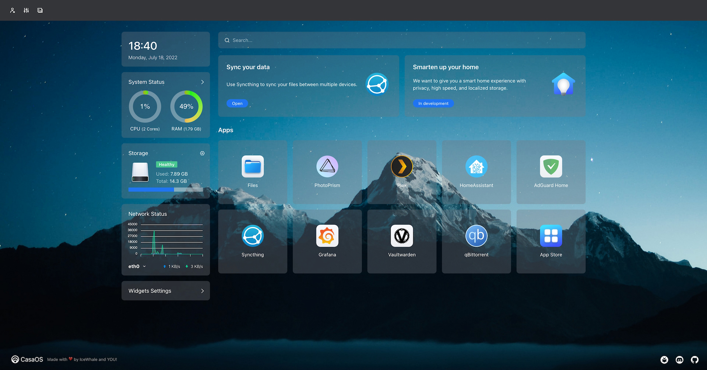

## Pour les débutants

Si vous commencez dans le self-hosting, on vous conseille de prendre quelque chose qui a peu de chance de casser, et qui vous permet de déployer vos services en quelques clics. Sans ça, vous allez devoir apprendre beaucoup de notions différentes pour pouvoir commencer, et c'est très souvent ce qui décourage les débutants.

Si jamais vous voulez creuser plus, il y aura de toutes façon beaucoup de ressources ci-dessous, donc ne vous prenez pas la tête et si vous voulez migrer plus tard et tenter de nouvelles choses, faites-le ! Gardez juste en tête que c'est plus facile de prendre le truc à son rythme, et de commencer petit.

### 🥇 YunoHost

[YunoHost](https://yunohost.org) est une distribution Linux Française qui permet de déployer des services facilement en quelques clics. 

Basée sur Debian (réputé pour sa stabilité), elle vous permet de déployer facilement un grand nombre d'applications disponibles sur son [catalogue](https://yunohost.org/fr/apps).

???+ question "Comment ça basé sur Debian ?"

    Les différents systèmes d'exploitation Linux sont en fait appelés des [distributions](https://fr.wikipedia.org/wiki/Distribution_Linux), car Linux étant open-source, on peut le redistribuer.

    Ces distributions fournissent le noyau Linux, mais aussi plein d'autres outils, comme une console pour interagir avec le système, des drivers pour certaines cartes graphiques, des logiciels préinstallés, etc...

    L'avantage, c'est que chacun peut un peu faire la version qu'il veut, vous trouverez donc forcément chaussure à votre pied un jour !

YunoHost gère automatiquement vos certificats TLS, votre reverse proxy, l'authentification de vos utilisateurs, et les mises à jours d'application. Cela vous permettra par exemple d'avoir votre propre petit clone de Netflix, ou votre cloud personnel, sans trop vous prendre la tête.

### CasaOS

[CasaOS](https://www.casaos.io/) est une application à installer sur un système Debian. Il fait un peu le même job, en permettant de déployer des applications relativement facilement à partir d'un catalogue d'application plus ou moins aussi fourni que celui de YunoHost.

Il est à noter que si vous ne savez pas quelle machine utiliser pour faire votre premier serveur et que vous prévoyez d'utiliser CasaOS, l'entreprise derrière le système vends aussi un mini-serveur appelé le [Zima Board](https://www.zimaboard.com/) qui est livré avec CasaOS de préinstallé !

!!! note "Pensez quand même à vérifier si vous n'avez pas un ancien PC qui traine, ou qu'un membre de la famille pourrait vous donner, ça reste + écolo ! En plus Linux est connu pour tourner sur n'importe quoi, il y a peu de chances que vous croisiez une incompatibilité quelque part."

## Pour aller + loin

Peut-être que vous avez déjà touché à des serveurs Linux par le passé, ou que vous avez déjà utilisé la cconsole sur votre ordinateur personnel, et que vous voulez aller un peu plus loin, pour être moins guidé, et un peu plus libre dans votre configuration.

### 🥇 Fedora

[Fedora Server](https://fedoraproject.org/fr/server/) est un système d'exploitation libre et open-source. Il est comparable dans les fonctionnalités qu'il offre avec d'autres systèmes d'exploitation que nous listeront plus bas.

Il se démarque néanmoins de Debian et Ubuntu par plusieurs points :
- Un rythme de mise à jour bi-annuel où aucune version n'est une LTS (Long-Term Support ou Support Long Terme). Cela force les utilisateurs à mettre à jour leur version de Fedora tous les six mois, ce qui est une relativement bonne chose.

- Les mises à jours d'une version de Fedora à une autre se passe bien plus souvent sans encombre que celle faites sous Ubuntu, de notre propre expérience.

- Fedora propose des paquets plus récents que ceux proposés par Debian ou Ubuntu, ce qui offre des fonctionnalités supplémentaires ainsi des gains de performance, pour peu que l'on mette à jour son serveur souvent.

- Le système d'exploitation fournit aussi [Cockpit](https://cockpit-project.org/), une interface web qui permet de configurer plein de fonctionnalités demandant autrement de faire des manipulations dans le terminal (qui peuvent parfois mal finir). Il est par exemple possible de formater un disque, ajouter un utilisateur, configurer ses interfaces réseau et son pare-feu, ou encore configurer les mises à jour et le reboot automatique du serveur à une heure donnée.

!!! note 
    Bien qu'il soit possible d'installer Cockpit sur d'autres systèmes, il est installé par défaut avec des plugins spécifiques à Fedora Server dans cette distribution, par exemple pour les mises à jour automatiques.

### Debian / Ubuntu

[Debian](https://www.debian.org/index.fr.html) est un système d'exploitation libre et open-source, tout comme [Ubuntu Server](https://ubuntu.com/download/server), un dérivé de Debian fourni par l'entreprise Canonical.

Entre les deux, nous préférons vous recommander Debian, notamment pour sa stabilité. Debian est une distribution Linux connue pour faire des mises à jour de paquets logiciels uniquement lorsqu'ils sont testés et approuvés, ce qui garantir que votre serveur sera le plus stable possible.

Nous déconseillons aussi Ubuntu pour plusieurs raisons :

- Des mises à jours de paquets plus fréquentes que sur Debian, mais moins testées, et quand même à la ramasse par rapport à Fedora.
- Des mises à jour de version qui ont tendance à avoir un problème en plein milieu d'une opération délicate, ce qui équivaut toujours à au moins une bonne nuit blanche pour réussir à s'en sortir.
- Un catalogue de paquets très proche de ceux de Debian : tout ce que vous installez sur Ubuntu, vous pourrez l'installer sur Debian et vice versa.
- Ubuntu est la seule distribution à mettre en avant l'utilisation de `snap`, son propre format de paquet qui cohabite avec les traditionels paquets `.deb` utilisés par Debian et tous ses dérivés, ce qui peut parfois poser pas mal de souci dans la gestion des logiciels installés sur le serveur.